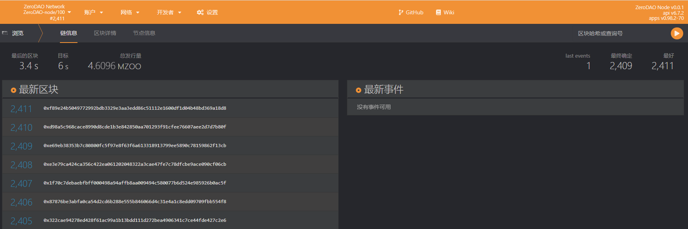

# Experience

## Connect to Polkadot.js

Once the node is running, open a browser and enter the link：https://polkadot.js.org/apps/#/explorer ，Click on "Development" and select "Local Node" 。To use it for the first time, you need to add the contents of the [types.json](https://github.com/ZeroDAO/ZeroDAO-node/blob/main/types/types.json) file to "Settings" - "Developers".



Once the connection has been successfully made, you can now see the outgoing blocks.

## Experience.app

If you need a deeper experience with ZeroDAO-node, or to compute some social graphs, we offer a front-end to the experience.

### Installation

```b
git clone https://github.com/ZeroDAO/experience-app
cd experience-app
yarn
```

### Run

```bas
yarn dev
```

Open the URL in your browser http://localhost:8080/ 。

### Importing data

The Game of Thrones character relationship test data is built into the `experience-app`, click on "Tests" in the left hand navigation, click on the "Start" button on the right hand side and the front end will automatically run a simulation to send various types of transactions to the chain. Please be patient as the browser may lag due to the large amount of data.

Once the data has been imported, you can see all the seeds from the `Seeds` page and click on them to go to the home page where you can see the character's trust relationships, reputation values and so on. If you have the `Polkadot.js` browser connected, you should be able to see a lot of transaction information and events.

### Customise your data

You are advised to customise the data to try out the results of different relational network calculations. You will need to prepare two pieces of data.

#### nodes.cvs

Stores the user information. The format is

| id      | label     |
| :------ | :-------- |
| USER_ID | user name |

#### edges.cvs

The trust relationship is stored. The format is

| source    | target    |
| :-------- | :-------- |
| USER_ID_1 | USER_ID_2 |

Next, calculate centrality, select seeds, and calculate reputation.

```bas
yarn preTest
```

This will automatically calculate all the data and write the results to the `data` folder. Run `yarn dev` again and import the data as described above. Now you can experience it in the front-end interface.
