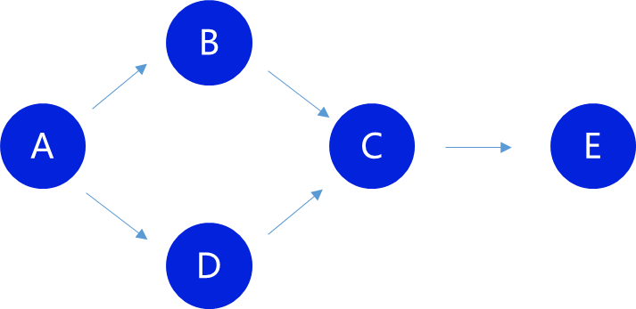

# Seed selection

In the latest version, the Betweenness centrality algorithm is used to select seeds. Because Betweenness centrality is more widely used, you can make efficient use of a computational framework with which you are familiar. At a later stage the algorithm will be adapted to use a pruned relational map to reduce the amount of data in the chain.

## Betweenness centrality

Betweenness centrality reflects the role of the user as a bridge in the network; the more shortest paths through a node, the higher the centrality. This paper focuses more on describing where the differences with common computational frameworks lie.

Calculating the centrality of point `C` in the above diagram, we obtain all shortest paths through `C`, the number of shortest paths between endpoints, and calculate the final score.

| Shortest paths      | Total | Score |
| :------------ | :--- | ---- |
| A - B - C - E | 2    | 50   |
| A - B - D - E | 2    | 50   |
| B - C - E     | 1    | 100  |
| D - C - E     | 1    | 100  |

The paths `A - B - C - E` and since there are `2` shortest paths between endpoints `A` and `E`, the respective scores are `100 / 2 = 50`. Here `100` is precision, meaning that two decimal places are retained, so that the data is invalid when it is greater than or equal to `100`.

Therefore, you should not use the Betweenness centrality data directly from any generic computing framework; they have accuracy problems and many of them use approximate algorithms. You can use them to quickly calculate a provisional centrality, find the batch of nodes with the highest centrality as seeds, then calculate all the shortest paths of each seed node from all other nodes, and finally calculate the exact score.

::: tip

The maximum number of seeds is obtained by the constant `maxSeedCount` and seed nodes with too low a score for uploading will not receive the reward. If the last ranked score is the same, the time to receive the reward will be determined.

:::

::: tip

Before adding seed candidates, you should have data ready for the challenge so that you do not miss the window in time to prepare the data and cause unnecessary damage. If your data is accurate, however, this should be very rare as there are other users who correct the wrong challenge.

:::

## Adding seed candidates

Once you have identified a seed, you can add a seed candidate by calling `zdRefreshSeeds.add(target, score)`. You need to ensure that your account balance is sufficiently collateralised and the system will automatically deduct it.

## Receive benefits

The proceeds from seeds need to be collected after all seeds have been confirmed, which requires all challenges against the seeds to be fully completed and collected. Call `zdRefreshSeeds.harvestSeed(seed) ` to collect and the system will send you your staking amount and proceeds.
