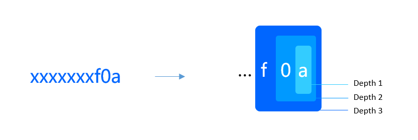

# Challenge Game

Computing the shortest path of a social graph on the chain is resource intensive, but shortest path verification is easy. Taking advantage of this feature we use a challenge game to verify the accuracy of the data.

## Roles

The Challenge Game has three roles: `Pathfinder`, `Challenger` and `Sweeper`.

### Pathfinder

Pathfinder is responsible for selecting the seeds at regular intervals, calculating the reputation of the user and uploading the results to the chain after staking a certain amount. The chain waits for a period of time during which Challenger can challenge the data and prove its results are more credible according to the process. Upon a successful challenge, Challenger will receive collateral funding from Pathfinder. If no challenge is made after the challenge time, Pathfinder can reclaim the collateral funds and receive a reward. On reputation refreshes, the reward is a percentage of the target user's social currency. The reward for a seed refresh is the entire prize pool of funds.

### Challenger

Challenger is responsible for maintaining the accuracy of the reputation data and seed data on the chain, and can staking a certain amount of money to challenge the data when errors are found. Challenger and Pathfinder are not fixed, as a successful Challenger challenge will result in Pathfinder accepting challenges from other Challengers. A successful challenge will result in the loss of all earnings, including the amount of your own staking. The total amount of rewards is therefore constantly accumulating, which ensures that the system is constantly approximating the authenticity of the data.

### Sweeper

To reduce the burden on node operations, all refresh data and challenge game data needs to be cleared by the beneficiaries at the same time as the proceeds are claimed. both Pathfinder and Challenger must keep the data on the chain clean, and if the proceeds are not claimed within a certain period of time, Sweeper can claim them by proxy, at the cost of Sweeper receiving a percentage of the proceeds.

## Challenge Reputation 

### Launching the challenge

Challenger can challenge the Pathfinder's refreshed reputation and upload all valid paths and scores (the score needs to be greater than 0). During the challenge phase, the chain does not verify that the score is calculated correctly, only that the paths are correct, which significantly reduces the amount of computation on the chain. after a successful challenge by Challenger, it enters the arbitration phase.

Including in the seed challenges below, we support *breakpoints* in all cases where large amounts of data need to be uploaded, i.e. the results can be uploaded in multiple transactions. This is useful in situations where the data results exceed the block weight, or where the network is congested.

### Arbitration

Other Challengers can arbitrate the data by uploading a shorter path or a different value within a defined time. At this point the calculation will be verified on the chain to ensure that all data in the arbitration phase is correct. The Challenger that initiated the arbitration still has to wait for the other Challengers to arbitrate, so the Challenger needs to point out all errors in order for the challenge to be successful.

## Challenge Seed 

First we calculate the seed path according to the seed selection rules. In the current version of ZeroDAO we use `Betweenness Centrality` to select the seeds, the advantage of this is that `Betweenness Centrality` is a common algorithm and easy to implement. In later versions, we will use cropped path trees to reduce the amount of computation and on-chain verification. But in any case, as the network becomes very large, the number of shortest paths past the seed user will be very large. Uploading them one by one to the chain for comparison and validation is not necessary. We need some method of indexing that allows Challenger to find and Pathfinder difference paths. That way, we can accurately verify the difference paths on the chain and determine whose data is more trustworthy, Pathfinder or Challenger.

### Examine and Reply

The way we find discrepancy data is to form a tree with a sum of data, the deeper it is, the smaller the amount of data it contains, and ultimately the smaller the result set is uploaded to the chain. So we only need a small number of interactions to find the differences. To achieve this, the results of the calculation first need to be processed. The results consist of two aspects: the paths and the scores. We hash the start and end points of the paths

As shown in the diagram, the first tier is the last digit, and we add up the scores with the same value at that position, giving us a maximum of 16 results. The second layer is the last digit and the penultimate digit with the same score, with a maximum of 256 results. challenger needs to find the position where the sum of the scores is different from the 16 values, using a `Examine` and `Reply` interaction to reach the final path result. The partitioned path results are smaller and we can verify them exactly on the chain.

In the current version of the ZeroDAO network, we pick two positions at a time with a maximum depth of 4. This means that we can perform fast verification for paths of at least 256 ^ 4 * n.

### Evidence

After an error has been found, Challenger can upload evidence. For example, uploading a shorter path to prove that Pathfinder's calculation is wrong. Sometimes the evidence is not strong enough, for example if Challenger uploads a shortest path through seed `A` with endpoints `C` and `D`, which does not exist in Pathfinder's data. However, the system is not sure if there is a shorter path between `C` and `D` that does not go through `A`. In such a case, the evidence would need to be determined by arbitration.

### Arbitration

Arbitration is a determination of the validity of the evidence. As noted above, other users show a shorter path from `C` to `D`, but not through `A`, in which case Challenger's proof is invalid. The arbitrated users will be co-beneficiaries of Pathfinder and will share equally in the pool of funds.

