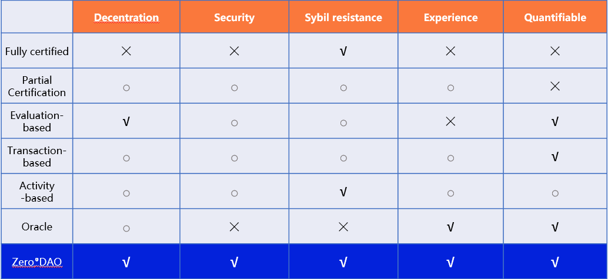

# Reputation System

The rapid development of the blockchain over the years has shown everyone its extraodinary value.However, the lack of a highly available reputation system hinders further development of the blockchain. A highly available reputation system would bring about at least two changes:

**Robot ≠ Human**

In "Play to Earn" rewards, UBI, even the dark forest of Ethereum, ubiquitos robots devor assets that should belong to users. Without a crediable identity, our economic behavior in the Metaverse will cost extremely high friction and loss. For Web 3.0, how can system return the right to the user if it can not identify whether there is a real person facing the screen or a fake identity?

**Capital ≠ Power**

The community-based blockchain is to a large extent a public resource. Anyone can participate in the governance and anyone can benefit from the development of the community. However, token voting allow the "capital is power" of the real world extends to the Web3. In that case, what is the point of our construction of the Web3, Metaverse?? "Capital is power" also makes the blockchain lose the characteristics of public resource. We need a reliable and long-term reputation identity system to work with a maching DAO mechanism to bring new governance methods.

## How is the ZeroDAO Reputation System different?

Soon after the birth of blockchain there was a consensus that 'reputation systems' could bring about fundamental change, with attempts at `Proof of personhood systems`, `Proof of participation` and `Identity Oracle`, to name but a few, which were They were either costly, not decentralised enough, or not resistant to `Sybil attacks`.

ZeroDAO's reputation system uses a decentralized method to calculate the user's reputation. It represents the user's credibility, influence, and credit. It is a real "decentralized identity". Extensive streaming social networks enable high reputation coverage. Later, DAO's vertical identity is introduced to form a three-dimensional identity that meets different applications. ZeroDAO will support smart contracts. You can develop and use DAPPs on the ZeroDAO chain to get the blessing of the native reputation system at low cost. As ZeroDAO is the infrastructure of reputation system, you can also cross-chain ZeroDAO's reputation system to other public chains, such as Ethereum or substrate ecology.

The following is a comparison of the ZeroDAO Reputation System with other categories of reputation systems:

