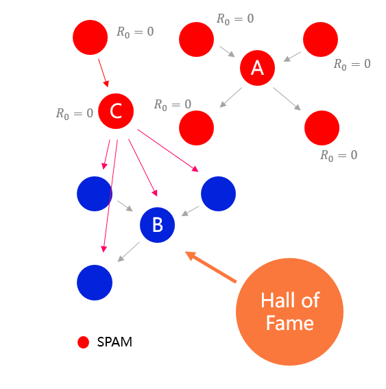

# TIR algorithm

Formerly known as Goolge's text retrieval algorithm for search engines, the TIR algorithm was used to replace the vulnerable PageRank algorithm and is computationally simple and requires no iteration compared to its TrustRank counterpart.

The TIR algorithm stems from the assumption that **highly influential users are less likely to trust fake users**. We first select the highest influential users from the entire network as seeds, and the smaller the shortest path of a given user from all seeds the higher the reputation. The following is a concrete implementation.

## Calculation reputation 

1. **Selecting seeds** - The longest shortest path through the most number of nodes is selected as the seed user, the larger the network, the higher the account cost about, the more difficult it is to cheat.
2. **Assignment** - Set the seed score to the constant R_max.
3. **Path length** - The path length is a confidence level, which stems from our assumptions. A low reputation user trusting a high reputation user is considered credible, a high reputation user trusting a low reputation user, and the path length is the natural logarithm of the reputation value difference. In this case, the larger the reputation value difference, the longer the path.
4. **Shortest path** - Calculate the weighted shortest path between the target node and the seed user. Using the `D` user as an example, the shortest path in the graph is ` Seed -> A -> D`.
5. **Calculating score transfer** - It is equally divided according to the number of source node trusts and is inversely proportional to the path length.
6. **Total score** - The score passed to each seed is calculated and the total sum is the reputation of that user.

## Sybil resistance

So far there is still a possibility of cheating, especially if the network is small and only another independent network larger than the existing one needs to be constructed. It will cause the system to incorrectly select cheating nodes as seed nodes.

Of course, when the network size is larger, we increase the cheating cost significantly by raising the account retention fee and increasing Gas to protect the network security. However, this is still not perfect and raises the cost of use for normal users at the same time.

To ensure that the network is mathematically secure, regardless of the size of the network and the amount of money the cheater has, the network can be guaranteed to be safe. We use the Hall of Fame model.

### Hall of Fame

#### The community selects a small number of Hall of Fame users

SPAM nodes have no reputation value, or very little reputation value they cannot influence the Hall of Fame selection

#### Join seed node distance

The shortest path between the seed and the Hall of Fame member is used as one of the parameters in the seed selection. Fake nodes cannot be trusted by the Hall of Fame members and therefore cannot become seeded users.

:::: tips

We will be adding a Hall of Fame election feature in the next release, along with `MACI` and a combination of reputation values.

::::
