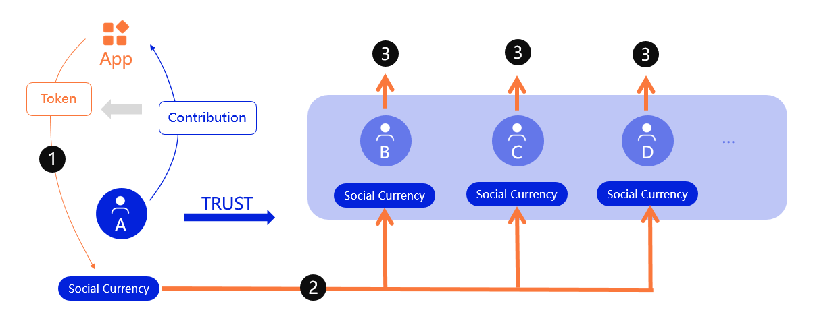
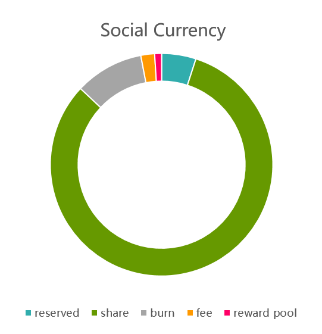

# Social Currency

## Incentive compatibility

Usually we think that rewarding good things will inspire more good things, but in fact this is not the case, like what would Twitter look like if it was a dollar a tweet? Yet that's exactly what we're doing in the Web3 era, we're issuing currency to reward users who contribute content and interaction to the social network. We shouldn't lose sight of the truth that this doesn't make Web3 social networks any more valuable than traditional social networks.

The early exploration of social networks in the blockchain was based on the ideal of users as shareholders, contributions as revenue and data as value, but the incentive model of monetising contributions is a big mountain that stands in the way of the ideal. As we run around in social networks to gain currency, social networks give us revenue but take away our joy. ZeroDAO's streaming social network not only gives you the assets you deserve, it also gives you joy. This joy is the joy of growth, the joy of sharing, the joy of helping others, in fact, these long-lost joys have long been written into the "sharing and freedom" DNA of the internet. We aim to create an incentive-compatible social currency.

## Incentive compatible social currency (ICSC)

ZeroDAO's social currency, an incentive compatible social currency (`ICSC`), is still quantified by social networking applications and settled as Token sent to users, for example `FacebookToken`. However, this social currency cannot be used directly by users and is temporarily frozen.

1. **Settlement** - The app quantifies user contributions and sends them to `A`s social currency account.
2. **Share** - The system periodically distributes A's pending distributions to `B` `C` `D` whom it trusts.
3. **Network** - 
`B` `C` `D` Similarly share the new proceeds to be distributed to form a value analysis network 

Allocated together at intervals by `pathfinder` when doing a reputation refresh, in the following manner.

1.  **Reserved** - Reserve the owner's free balance. The percentage can be adjusted by the community.
2.  **Share** - Transfer to the social currency of users trusted by the owner.
3.  **Fee** - `pathfinder` fee。
4.  **Burn** - Share to all users.
5.  **Reward pool** - Used to solve the verifier's Dilemma and seeds Refresh.
