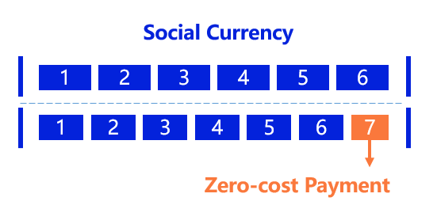

# Zero-cost Payment

A payment model where the user loses nothing, but the merchant receives money. This is achieved through ZeroDAO's social currency.

## Institutional Accounts ##

A special type of account which can be trusted in the same way as a normal account, the difference being that it only participates in the distribution and not in the calculation of the reputation system. The amount allocated goes directly to the free account and is not reallocated.

## Zero-cost

Social currency was meant to be shared with other users, now it's just one more share, the user doesn't lose anything, but the merchant receives the money. Users are more willing to accept such a payment model, which is a new payment model that can be applied to a variety of scenarios. For example, charities will be able to raise funds better this way and the open source community will receive more funding. In addition, through this model we solve the payment dilemma of decentralised storage.

::: tip

However, it is currently limited to payments to trusted institutions, and large-scale commercial use ( e.g. in pay-per-month music applications, decentralized storage payments ) needs to Solving collusion attack. 

:::

