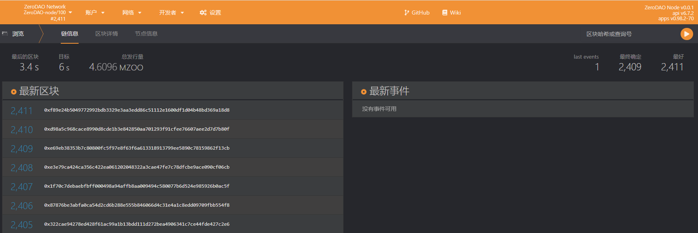

# 体验

## 连接 Polkadot.js

节点运行后，打开浏览器并输入链接：https://polkadot.js.org/apps/#/explorer ，点击“Development“，选择“Local Node” 。首次使用，你需要将 [types.json](https://github.com/ZeroDAO/ZeroDAO-node/blob/main/types/types.json) 文件中的内容添加到 “设置” - “开发者” 中。



待连接成功后，你可以看到出块情况了。

## Experience.app

如果你需要更深度地体验 ZeroDAO-node ，或者计算一些社交图谱，我们提供了一个体验前端。

### 安装

```base
git clone https://github.com/ZeroDAO/experience-app
cd experience-app
yarn
```

### 运行

```base
yarn dev
```

在浏览器中打开网址 http://localhost:8080/ 。

### 导入数据

`experience-app` 中内置了 《权力的游戏》 人物关系测试数据，点击左侧导航中的 "Tests" ，在右侧点击 "Start" 按钮，前端将自动运行模拟运行，向链上发送各种类型的交易。因为数据量较大，浏览器可能会卡顿，请耐性等待。

数据导入完毕后，你可以从 `Seeds` 页面看到所有的种子信息，点击他们进入主页，可以看到人物的信任关系、声誉值等等。如果你连接了 `Polkadot.js` 浏览器，你应该可以看到很多交易信息和事件。

### 自定义数据

你最好自定义数据来尝试不同的关系网络计算结果。你需要准备两份数据

#### nodes.cvs

保存用户信息。格式为

| id      | label     |
| :------ | :-------- |
| USER_ID | user name |

#### edges.cvs

保存信任关系。格式为

| source    | target    |
| :-------- | :-------- |
| USER_ID_1 | USER_ID_2 |

接下来计算中心度、选取种子、计算声誉：

```base
yarn preTest
```

这将自动计算所有数据，并将结果写入 `data` 文件夹中。再次运行 `yarn dev` ，并按照前面所述导入数据。现在你可以在前端界面中体验了。

