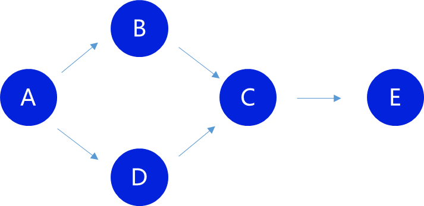

# 种子选取

在最新版本中，采用了介数中心度算法来选取种子。因为介数中心度应用较为广泛，你可以高效地利用你熟悉的计算框架。在后期将对算法进行调整，采用修剪过的关系图谱，以减少链上数据量。

## 介数中心度

介数中心度反映了用户在网络中的桥梁作用，通过某节点的最短路径越多，则中心度越高。本文更侧重于描述与常见计算框架的差异之处。

计算上图中 `C` 点的中心度，我们获取经过 `C` 的所有最短路径、端点间最短路径条数，并计算最终得分。

| 最短路径      | 总数 | 得分 |
| :------------ | :--- | ---- |
| A - B - C - E | 2    | 50   |
| A - B - D - E | 2    | 50   |
| B - C - E     | 1    | 100  |
| D - C - E     | 1    | 100  |

路径 `A - B - C - E`，由于端点 `A` 和 `D` 之间的最短路径有 `2` 条，因此各自的得分为 `100 / 2 = 50` 。此处的 `100` 为精度，意味着保留小数点后两位，因此当其大于等于 `100` 时，该数据是无效的。

因此，你不应当直接使用任何通用计算框架的介数中心度数据，他们存在精度问题，并且很多框架采用的是近似算法。你可以使用他们快速计算临时的中心度，找出中心度最高的一批节点作为种子，再计算每个种子节点距其他所有节点的所有最短路径，最后再计算精确的得分。

::: tip

通过常数 `maxSeedCount` 获得最多种子用户数量，上传分值过低的种子节点，将无法获取奖励。如果排名最后的分值相同，则按照领取收益的时间来确定。

:::

::: tip

在添加种子候选人前，你应当准备好应对挑战的数据，以免来不及准备数据错过窗口期，导致不必要的损失。不过如果你的数据准确，这种情况应该非常罕见，因为有其他用户纠正错误的挑战。

:::

## 增加种子候选人

确定种子后，你可以通过调用 `zdRefreshSeeds.add(target, score)` 来添加一个种子候选人。需要确保你的账户余额足够抵押，系统会自动扣除。

## 领取收益

种子的收益领取，需要在所有种子被确认后，这要求所有针对种子的挑战全部完成并领取。调用 `zdRefreshSeeds.harvestSeed(seed) ` 即可领取，系统将会把你的抵押金额和收益发送给你。
