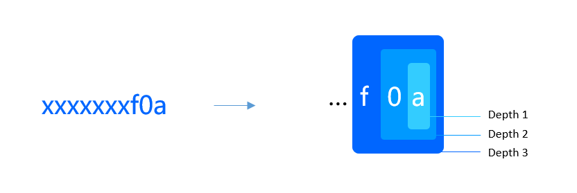

# 挑战游戏

在链上计算社交图谱的最短路径需要耗费大量资源，但最短路径验证却很方便。利用这一点特性我们采用挑战游戏来验证数据准确性。

## 角色

挑战游戏有三种角色：开拓者和挑战者。

### 开拓者 ( Pathfinder )

开拓者负责每隔一段时间选取种子、计算用户声誉，抵押一定金额后，将结果上传到链上。链上的数据要等待一段时间，挑战者可在这段时间内对数据发起挑战，并根据流程证明自己的结果更可信。挑战成功后，挑战者将获得开拓者的抵押资金。如果超过挑战时间未有挑战，开拓者可收回抵押资金并获得奖励。在声誉刷新时，奖励为目标用户一定比例的社交货币。种子刷新的奖励则是整个奖金池中的资金。

### 挑战者 ( Challenger )

挑战者负责维护链上声誉数据和种子数据的准确性，当发现错误后，可以抵押一定金额对数据发起挑战。挑战成功后将获得开拓者的抵押资金。挑战者和开拓者并不是固定不变的，挑战者挑战成功会转变为开拓者接受其他挑战者的挑战。如果被挑战成功，将会失去所有收益，包括自己的抵押金额。因此，奖励的总额是不断累积的，这保证了系统不断逼近数据的真实性。

### 清道夫 (sweeper)

为了减少节点运行的负担，所有刷新数据和挑战游戏的数据都需要获利者在领取收益的同时进行清除。开拓者和挑战者都必须保障链上数据的清洁，如果在一定时间内未领取收益，则清道夫可代理领取，代价是清道夫将从中获得一定比例的收益。

## 声誉挑战

### 发起挑战

挑战者可以对开拓者刷新的声誉进行挑战，并且上传所有有效路径和得分（得分需要大于0）。在挑战阶段，链上并不验证分值的计算结果是否正确，仅仅验证路径是否正确，这样可以大幅减少链上的计算量。挑战者挑战成功后，进入仲裁阶段。

包括以下的种子挑战中，在需要所有上传大量数据的情况下，我们都支持断点续传，即可以将结果分成多笔交易上传。这在数据结果超过区块权重，或网络拥堵的情况下很有用。

### 仲裁

其他挑战者可以在规定的时间内上传更短的路径或不一样的数值，对数据进行仲裁。此时将在链上对计算结果进行验证，确保仲裁阶段的所有数据都是正确的。发起仲裁的挑战者依然需要等待其他挑战者的仲裁，因此挑战者需要指出所有错误才能挑战成功。

## 种子挑战

首先我们按照种子选取规则，对种子路径进行计算。在 ZeroDAO 当前版本中，我们使用 `介数中心度` 的方式来选取种子，这么做的好处是 `介数中心度` 是一个常用算法，方便我们实现。在后期版本中，我们会采用经过裁剪的路径树，以减少计算量和链上验证量。但无论如何，在网络变得很大时，经过种子用户的最短路径的数量将会非常庞大。将其一一上传到链上进行对比和验证是没有必要的。我们需要通过一定的索引方法，让挑战者找到和开拓者差异路径。如此一来，而我们可以在链上准确地验证差异路径，从而确定开拓者和挑战者谁的数据更可信。

### 质询和回答

我们寻找差异数据的方式是形成一颗拥有数据和的树，深度越深，则包含的数据量越小，最终得到很少的结果集上传到链上。于是我们仅需要少量的交互即可找到差异之处。要实现这一点，首先需要对计算结果进行处理。结果包括两方面：路径和得分。我们对路径的起点和终点进行哈希，

如图所示，第一层为最后一位数，我们把该位置值相同的得分相加，最多有16个结果。第二层为最后一位和倒数第二位相同的得分相加，最多有256个结果。挑战者需要从16个数值中，找到得分总和不一样的位置，采用质询和回答的交互来达到最终的路径结果。分隔后的路径结果是较小的，我们完全可以在链上验证了。

当前版本的 ZeroDAO 网络中，我们每次选取两个位置，最大深度为 4。也就是说，我们可以对至少 256 ^ 4 * n 的路径进行快速验证。

### 证据

在发现错误后，挑战者可以上传证据。例如，上传更短的路径，来证明开拓者的计算是错误的。而有时证据的证明力会不足，例如挑战者上传了一条经过种子 `A` 的最短路径，端点为 `C` 和 `D`，而这条路径在开拓者的数据中并不存在。但系统并不能确定 `C` 和 `D` 之间是否存在更短的路径不经过 `A` 。这样的情况下，证据需要经过仲裁确定。 

### 仲裁

仲裁是对证据的有效性的判定。如上面所述，其他用户出示了 `C` 到 `D` 的更短的路径，但不经过 `A` ，如此一来挑战者的证明则是无效的。仲裁的用户将作为开拓者的共同受益人，平分资金池中的资金。

