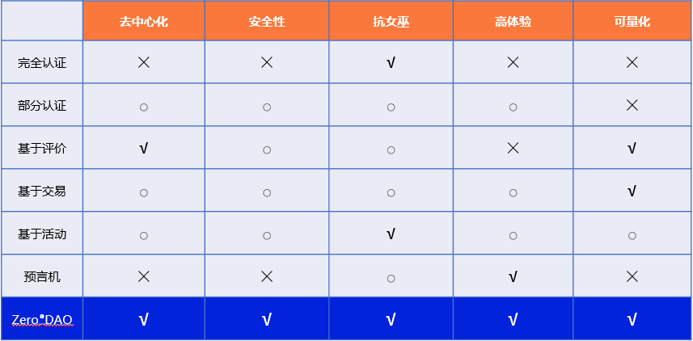

# 声誉系统

区块链多年快速的发展向人们展示了其非同凡响的价值，但缺乏高可用性的声誉系统阻碍了区块链的进一步发展。一个高可用的声誉系统将至少带来以下两点变革：

**机器人 ≠ 人**

在Play to Earn奖励、UBI、甚至以太坊的黑暗森林中，无处不在的机器人吞噬着本应该属于用户的资产。缺乏可信身份，我们在元宇宙的经济行为将要付出极高的摩擦和损耗。对于Web3.0来说，如果系统不能识别屏幕背后到底是真实用户还是伪造的假身份，怎么谈得上让权利回归用户自己？

**资本 ≠ 权力**

社区化的区块链很大程度上是一种公共资源，任何人都可以参与治理，任何人都可以从共建的社区发展中获益。然而代币投票让现实世界的“资本即权力”延续到元宇宙，既然如此，我们构建元宇宙还有什么意义？"资本即权力"也让区块链失去了公共资源的特性。我们需要可靠的、拥有长久声誉的身份系统和与之匹配的DAO机制，从而带来新的治理方式。

## ZeroDAO 声誉系统有何不同？

区块链诞生后不久人们对“声誉系统”能带来根本性的变化达成共识，尝试了身份证明系统（Proof of personhood systems）、参与证明（Proof of participation）以及身份预言机等等，他们要么成本高昂，要么不够去中心化，要么无法抵御女巫攻击。

ZeroDAO的声誉系统采用去中心化的方式计算用户的声誉，他代表着用户的可信度、影响力、信用，是真正意义上的“去中心化身份”。广泛的流社交网络使得声誉具有高覆盖度，之后引入 DAO 的垂直身份，形成满足不同应用的立体身份。ZeroDAO 将支持智能合约，你可以在ZeroDAO 链上开发、使用Dapp，以低成本地获得原生的声誉系统加持。ZeroDAO 作为声誉系统的基础设施，你也可以将ZeroDAO 的声誉系统跨链至其他公链，例如以太坊或substrate生态。

以下是 ZeroDAO 声誉系统和其他类别声誉系统的对比：

