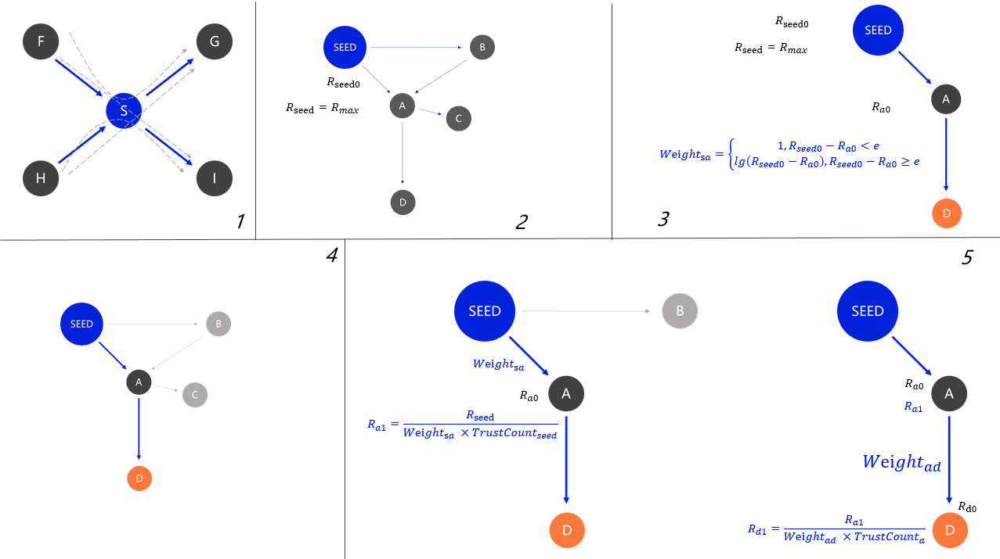
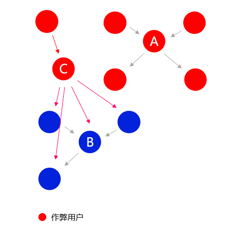
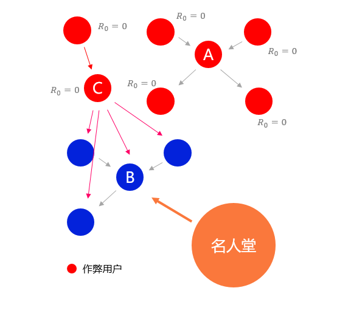

# TIR 算法

TIR算法前身为Goolge用于搜索引擎的文本检索算法，其用来取代易被攻击的PageRank算法，与同类型的 TrustRank 算法相比，他计算简单，无需迭代。

TIR算法源于一个假设：**高影响力用户不太可能信任虚假用户**。我们首先从整个网络中选取最高影响力的用户作为种子，某用户距所有种子的最短路径越小则声誉越高。以下是具体的实现：

## 声誉计算

1. **选取种子** - 选取最长的最短路径经过次数最多的一批节点为种子用户，网络越大，账号成本约高，则作弊难度越高。
2. **赋值** - 将种子分值设为常数 R_max。
3. **路径长度** - 路径长度是一种置信度，这源于我们的假设。低声誉值用户信任高声誉值用户，则视为可信的，高声誉值用户信任低声誉值用户，路径长度则为声誉值差的自然对数。此时，声誉值差别越大，则路径越长。
4. **最短路径** - 计算目标节点与种子用户加权最短路径。以`D`用户为例，图中最短路径为` Seed -> A -> D `。
5. **计算分值传递** - 根据源节点信任数量均分，并与路径长度成反比。
6. **总分值** - 计算每个种子传递过来的分值，总和即为该用户声誉。

## 抗女巫攻击

目前为止仍然具有作弊的可能性，特别是在网络较小的情况下，只需要构造一个大于现有网络的另一个独立网络，或精心构造的关系网络。将导致系统错误选取作弊节点作为种子节点。

当然，在网络规模较大时，我们通过提高账号保留费用，提高Gas来大幅增加作弊成本，保护网络安全。但这样做仍然是不够完美的，同时提高了正常用户的使用成本。攻击模式如下图所示：

为了保证数学上的安全性，无论网络大小，无论作弊者拥有多少资金，都可以保证网络是安全的。我们采用名人堂模式：

### 名人堂

#### 社区选取少量的名人堂用户

社区选出少量名人堂成员，作弊节点无声誉值，或声誉值很小他们无法左右名人堂选取。

#### 加入种子节点距离

在种子选取时，将种子与名人堂成员的最短路径作为参数之一，虚假节点无法得到名人堂成员信任，因此无法成为种子用户。

:::: tips 进度

我们将在下个版本中加入名人堂选举功能，同时拥有 MACI 并结合声誉值。

::::
