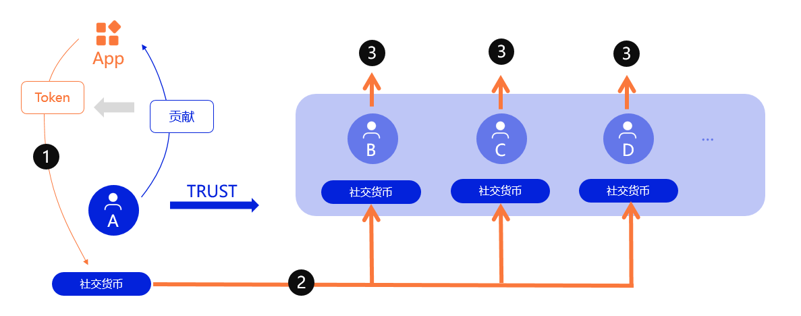
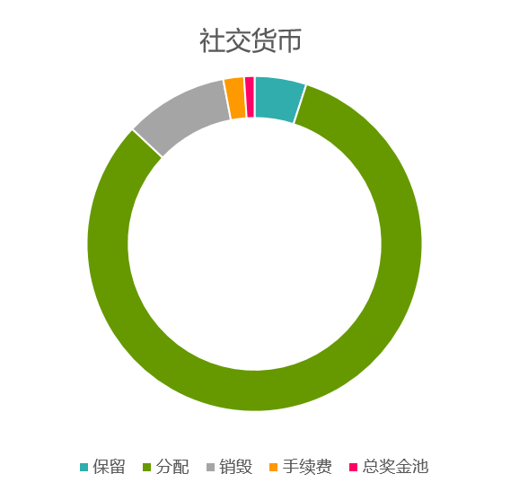

# 社交货币

## 激励相容

通常我们认为奖励好的事情会激发更多好的事情，事实上并非如此，相像以下如果发一条推特一块钱，那么推特会变成什么样子？然而这正是我们在Web3时代做的事情，我们发行货币奖励那些对社交网络贡献内容和互动的用户。我们不应该忽视真相，这并不会让Web3社交网络比传统社交网络更有价值。

区块链早期的社交网络探索中，以用户即股东、贡献即收益、数据即价值为理想，但贡献货币化的激励模式是阻碍通往理想的一座大山。当我们为获取货币在社交网络中奔波时，社交网络给了我们收益，却让我们失去快乐。激励好的行为有可能让好的行为消失，这就是经济学上的激励不相容。ZeroDAO 的流社交网络不仅给你带来你应有的资产，还带给你快乐。这种快乐是成长的快乐、分享的快乐、帮助他人的快乐，其实这些久违的快乐其实早就写在互联网“分享、自由”的基因中。我们旨在打造一个激励相容的社交货币。

## 激励相容的社交货币 ICSC

ZeroDAO 的社交货币，是一种激励相容的社交货币(` ICSC `)，社交网络应用依然量化用户贡献并结算为 Token 发送给用户，例如 `FacebookToken`。但这部分社交货币用户并不能直接使用，而是暂时处于冻结状态。

1. **结算** - 应用量化用户贡献并发送到 `A` 的社交货币账户。
2. **分享** - 系统定期将 A 的待分配收益分配给其信任的 `B` `C` `D`。
3. **网络** - `B` `C` ` D` 同样将新的待分配收益分享，形成价值分析网络 

每隔一段时间由 `pathfinder` 在进行声誉刷新时一起分配，分配方式如下：

1.  **用户保留收益** - 解冻一定比例的金额到用户余额，比例可由社区调整，以适应不同运营状态。
2.  **分配给信任的用户和机构** - 平均分配给该用户信任的用户，进入其待分配金额池中。
3.  **手续费** - `pathfinder` 收取的手续费。
4.  **销毁** - 可以理解为分享给所有用户。
5.  **总奖金池** - 一小部分发送到总奖金池，用于种子刷新和验证者困境等等。