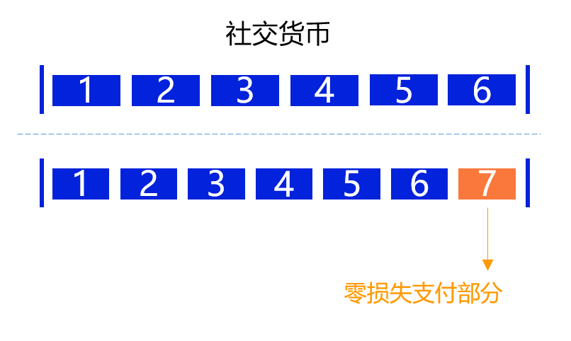

# 零损失支付

一种用户没有任何损失，但是商家却收到钱的支付模式。这是通过 ZeroDAO 的社交货币实现的。

## 机构账户 ##

一种特殊的账号，它与普通账号一样可被信任，不同的是其只参与分配，不参与声誉系统计算。分配到的金额直接进入自由账户，不再次分配。

## 零损失

社交货币本就是用来分享给其他用户的，现在只是多分了一份而已，用户并没有任何损失，但商家却收到了钱。用户更愿意接受这样的支付模式，这是一种全新的支付模式，可适用于多种场景。例如公益慈善将可以通过这种方式更好地筹集资金，开源社区获得更多的资助。另外，通过这种模式我们解决了去中心化存储的支付困境。

::: tip

零成本支付大规模商用，仍需解决合谋恶意套现问题。

:::

